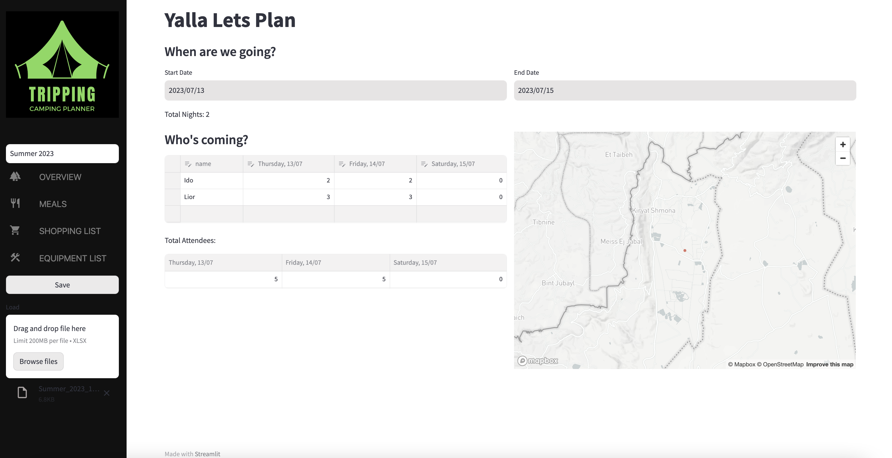
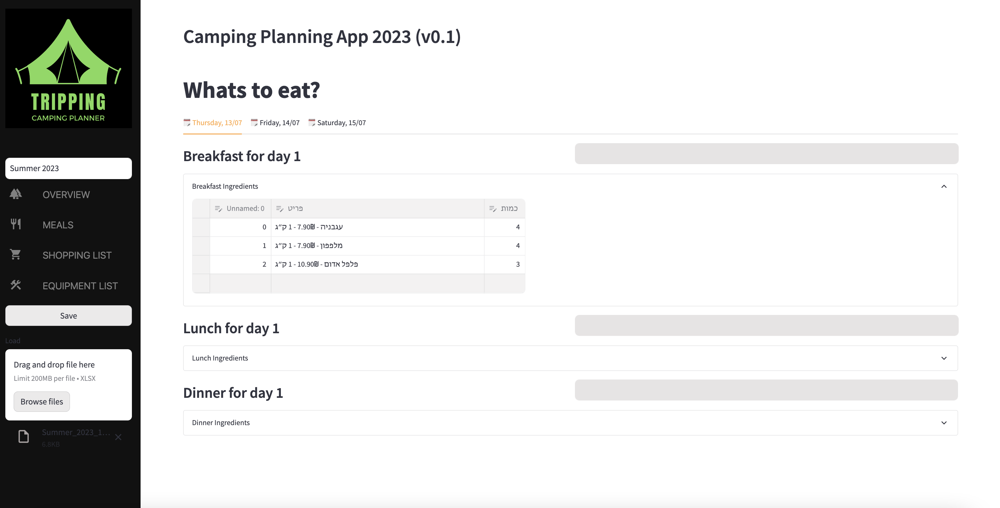

# A Simple Camping Trip Planning app

## Disclaimer
- This is a work in progress
- Grocery lists and prices are based on Israeli supermarket prices and are thus in Hebrew only for now
- Saving and Loading is still in Beta

## Main Features
- Monitor Attendees
- Plan meals
- Autogenerate shopping list with live price updates
- Create and export equipment lists

## Installation
1. Clone the repo
2. Install dependencies (`poetry install + poetry shell`)
3. Run the app - `streamlit run app/main.py`

## Snapshots

## License
[MIT](https://choosealicense.com/licenses/mit/)
